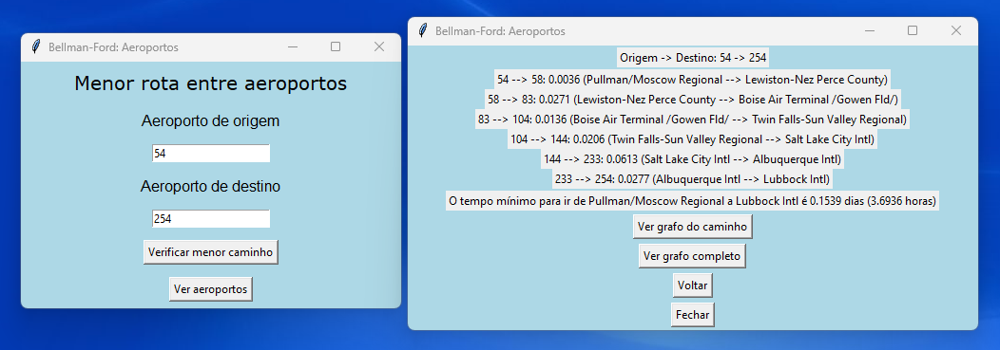
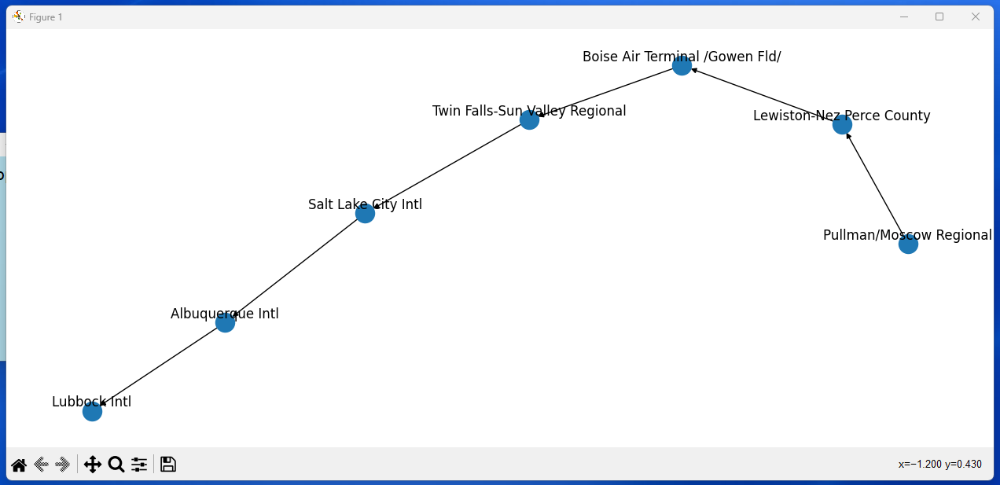
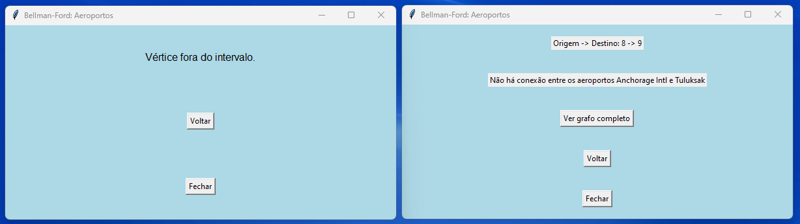

<h1 align="center">Implementação do Algoritmo de Bellman-Ford para encontrar o menor caminho entre linhas aéreas :airplane:</h1>

## :memo: Descrição
A partir da base de dados http://vlado.fmf.uni-lj.si/pub/networks/data/mix/USAir97.net, o algoritmo de Bellman-Ford foi implementado para encontrar o menor tempo, em dias, para conectar duas linhas aéreas dos Estados Unidos. Uma interface gráfica foi criada para melhorar a experiência do usuário, imprimindo o caminho e o seu peso (tempo, em dias). Além disso, foi desenvolvido um visualizador que permite a observação do grafo completo e do subgrafo do caminho solicitado pelo usuário. Este projeto foi desenvolvido para a disciplina de Algoritmos e Estrutura de Dados.

## :wrench: Tecnologias utilizadas
- Python
- Tkinter
- Matplotlib
- Networkx
- Graphviz

## 	:arrow_forward: Executar o projeto
Para rodar o projeto, basta executar o arquivo 'main.py'. 

## :camera: Imagens
  
 Exemplo do menor caminho entre as linhas aéreas 54 e 254

 

  

 
  
 Grafo do menor caminho entre as linhas aéreas 54 e 254 

 

  

 Caso o vértice informado seja negativo ou maior que o número de vértices existentes ou a conexão não exista no banco de dados, aparecem os seguintes alertas 

 

  

 
- Projeto desenvolvido com Daniel Zamboni
